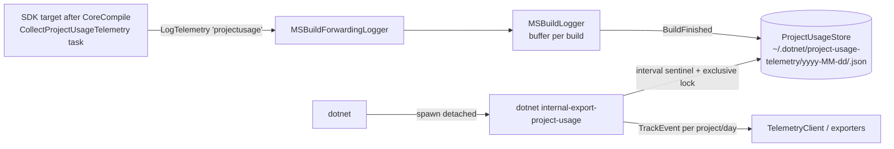

# Project usage telemetry: collect → aggregate → export

## Problem
The CLI needs per-project usage data for every build: TFMs, RIDs, project type, file counts by extension, compiler reference names, and SDK version. The CLI must not send this data on each build. A local sink aggregates it per user, per UTC day, and per project. A hidden background command exports completed days at an interval. All CLI-side pieces must be Native AOT capable and well tested.

## Decisions (confirmed)
- **Reference names**: send framework and known-public names in clear text. Hash all other names with SHA-256 and normalized casing.
- **File counts**: the sink keeps the union of distinct files per extension. It stores hashed project-relative paths, so it records the maximum distinct count. Exported events contain **only counts by extension**.
- **Export window**: export **completed UTC days only**. Honor telemetry opt-out on every path: collection, sink write, spawn, and export.
- **Trigger**: every real command spawns the export process in the background. Informational and short commands do not spawn it: `--info`, `--version`, `--list-*`, help, completions, and the internal commands. The spawned command checks the interval and lock.

## Architecture


### 1. Collection (MSBuild, `src\Tasks`)
- New task `CollectProjectUsageTelemetry` in Microsoft.NET.Build.Tasks. It follows the `AllowEmptyTelemetry` pattern and calls `IBuildEngine5.LogTelemetry`.
  - Inputs: `ProjectFullPath`, `ProjectExtension`, `TargetFramework(s)`, `RuntimeIdentifier(s)`, `SdkVersion` (`$(NETCoreSdkVersion)`), `References` (`@(ReferencePathWithRefAssemblies)`), `ProjectItems` (`@(Compile);@(None);@(Content);@(EmbeddedResource);@(AdditionalFiles);@(Page)…`), `KnownPublicReferenceNames` (framework/targeting-pack and NuGet-package-derived references, from item metadata such as `FrameworkReferenceName`, `NuGetPackageId`, and `ExternallyResolved`).
  - The task computes these values:
    - Project ID: `Sha256(normalized full path)`.
    - Reference names: the file name without `.dll`. The task hashes a name unless it is public (framework, ref-pack, or NuGet).
    - Per-extension sets of hashed project-relative file paths, with the extension lowercased.
  - Encoding: string properties because LogTelemetry is `IDictionary<string,string>`. The task uses `;`-joined lists and one compact JSON property for the file map. The logger parses this JSON with a source-generated context.
- New target `_CollectProjectUsageTelemetry` in a new or existing `.targets` file. It uses `AfterTargets="CoreCompile"`, so it runs even when the CLI skips CoreCompile. Conditions:
  - Do not run when `'$(DesignTimeBuild)'=='true'`.
  - Do not run when `$(DOTNET_CLI_TELEMETRY_OPTOUT)` is true.
  - Users can opt out with `$(GenerateProjectUsageTelemetry)!='false'`.
  - Each per-TFM inner build sends its own event. The sink combines them as a union.

### 2. Logger interception (`src\Cli\dotnet\Commands\MSBuild\MSBuildLogger.cs`)
- `OnTelemetryLogged`: the logger handles the `projectusage` event separately and never sends it directly. It parses and buffers the event in a per-build dictionary keyed by project hash. It merges multiple events for the same project inside the build.
- `OnBuildFinished`: the logger flushes the buffer to `ProjectUsageStore.Merge(utcToday, records)` and swallows all exceptions. It resets per-build state so the logger works in the MSBuild server. The logger does nothing when telemetry is disabled.
- The logger keeps the test constructor so that tests can inject a store, clock, and telemetry client.

### 3. Sink: pluggable `IProjectUsageStore` (shared, `src\Cli\dotnet\Telemetry\ProjectUsage\`, linked into dotnet-aot)
- Root: `Path.Combine(CliFolderPathCalculator.DotnetUserProfileFolderPath, "project-usage-telemetry")`. Each backend gets its own subfolder (`json\`, `sqlite\`, `binary\`), so switching backends never mixes data. Shared files at the root: `.last-export` (sentinel) and `.export.lock`. The export lock and the sentinel do not depend on the backend.
- Interface:
  ```csharp
  interface IProjectUsageStore
  {
      void Merge(DateOnly utcDay, IReadOnlyCollection<ProjectUsageRecord> records); // must be safe across processes
      IEnumerable<DateOnly> GetDays();
      IEnumerable<ProjectUsageSnapshot> ReadDay(DateOnly utcDay);   // aggregated: sets + per-ext distinct counts
      void DeleteProject(DateOnly utcDay, string projectId);
      void DeleteDay(DateOnly utcDay);
  }
  ```
  `ProjectUsageSnapshot` exposes per-extension **counts** only. Each backend decides how to store hashes internally.
- `ProjectUsageStoreFactory.Create(root, env)` selects the backend from `DOTNET_CLI_PROJECT_USAGE_STORE=json|sqlite|binary`. The default is set after the benchmark. An unknown value falls back to the default.
- Shared rules for all backends:
  - Exact union semantics.
  - 64-bit (8-byte) file-path hashes, created by truncating SHA-256 of the normalized relative path.
  - Failures are swallowed and never break a build.
  - A `SchemaVersion` value is recorded.
- **JsonProjectUsageStore**: `<day>\<projectHash>.json`. Read-merge-rewrite runs in a stream opened with `FileShare.None`, with bounded retry and backoff. A `JsonSerializerContext` with source generation keeps it AOT-safe. File hashes are stored as hex strings. A corrupt file is replaced.
- **SqliteProjectUsageStore**: one `usage.db` file with WAL, `busy_timeout`, and `synchronous=NORMAL`.
  - Tables: `project(day, project_id, build_count, first_seen, last_seen)`, `attr(day, project_id, kind, value)` (TFM, RID, type, SDK, reference), and `file(day, project_id, ext, hash BLOB)`. All tables are `WITHOUT ROWID` with composite PKs.
  - Each merge runs in one `BEGIN IMMEDIATE` transaction with `INSERT OR IGNORE` and an upsert of the counter.
  - Reads use `COUNT(*) … GROUP BY ext`.
  - The store uses the raw `Microsoft.Data.Sqlite` API with no ORM. It calls `SQLitePCL.Batteries_V2.Init()` or sets the provider explicitly for AOT.
- **BinaryProjectUsageStore**: `<day>\<projectHash>.bin`.
  - Format: a magic value and a version, then length-prefixed UTF-8 string sets, then per-extension blocks of sorted `ulong` hashes.
  - Merge is read-merge-rewrite with a sorted-merge union, under `FileShare.None`, using `BinaryReader` and `BinaryWriter`.
  - The format is the most compact, with no allocation-heavy parsing.
- Model `ProjectUsageRecord` (input from one build):
  - `ProjectId`
  - `ProjectTypes` (set)
  - `TargetFrameworks` (set)
  - `RuntimeIdentifiers` (set)
  - `SdkVersions` (set)
  - `References` (set)
  - `Files`: map from extension to a set of hashed paths
  - `BuildCount`
  - `FirstSeen` and `LastSeen` timestamps
- Testable constructor arguments: root dir, `TimeProvider`, and the env getter.
- **SQLite dependency work**:
  - Add `Microsoft.Data.Sqlite.Core` and `SQLitePCLRaw.bundle_e_sqlite3` (or a provider package) through `Directory.Packages.props`.
  - Make sure the redist layout ships `e_sqlite3` for every SDK RID.
  - For dotnet-aot, link `e_sqlite3` statically through `NativeLibrary`/`DirectPInvoke`, or ship it next to the binary.
  - For source-build, use the system `libsqlite3` provider, or exclude the SQLite backend with `#if` and fall back to the default. **This needs review by the source-build/VMR owners.**
- **Benchmark**: new BenchmarkDotNet project `test\ProjectUsageStore.Benchmarks`, or a perf test in an existing harness. It runs the same workloads against every backend:
  - Merge for small projects (50 files), large projects (10k files), and huge projects (50k files).
  - Repeated identical merges (the common case).
  - Merge with a changed file set.
  - 8 concurrent processes merging the same project.
  - `ReadDay` with 200 projects, and delete.
  
  It reports time, allocations, and bytes on disk. The default backend is chosen from these results and recorded in the docs.

### 4. Export command: `dotnet internal-export-project-usage` (hidden)
- Definition: `src\Cli\Microsoft.DotNet.Cli.Definitions\Commands\Hidden\InternalExportProjectUsage\…` with `Hidden = true`. The definition is registered in `DotNetCommandDefinition`.
- Wiring: real action in **both** `Parser.ConfigureManagedActions` and `Parser.ConfigureAotActions` (AOT handles it natively, no managed fallback).
- `ProjectUsageExporter.Run()`:
  1. If telemetry is disabled, return 0.
  2. If `.last-export` is newer than the interval, return 0. The interval comes from `DOTNET_CLI_PROJECT_USAGE_EXPORT_INTERVAL_HOURS`, default 24, and is read through `EnvironmentVariableNames`.
  3. Open `.export.lock` with `FileShare.None` and `FileOptions.DeleteOnClose`. On `IOException` (held), return 0 as a no-op.
  4. Check the sentinel again while holding the lock.
  5. For each day directory earlier than today (UTC), and for each project file:
     - Send event `projectusage` with these properties: `Date`, `ProjectId`, `ProjectTypes`, `TargetFrameworks`, `RuntimeIdentifiers`, `SdkVersions`, `References`, `FileCounts` (JSON `{ext: count}`), and `BuildCount`.
     - Send each event inside an `Activity` so that `TrackEvent` attaches.
     - Delete the file after it is handed to the telemetry client.
     - Delete the empty day directories.
  6. Prune day directories older than the retention period, `DOTNET_CLI_PROJECT_USAGE_RETENTION_DAYS` (default 30).
  7. Touch the sentinel, then `FlushProviders` so the persistent exporter writes to disk.
  8. Always return 0. Errors are swallowed and can be traced with `DOTNET_CLI_TELEMETRY_LOG`-style logging.
- An `IProjectUsageEventSink` abstraction over `ITelemetryClient` supports tests.

### 5. Background trigger
- `ProjectUsageExportLauncher.TryLaunch(hostPath)` is shared and linked into AOT. It is called near the end of:
  - managed `Program` (after command execution, before the telemetry flush), with `Environment.ProcessPath`.
  - AOT `NativeEntryPoint` for commands handled in-process, with `hostPath`.
  - It runs only once per process. The process does not launch it a second time after an AOT-to-managed handoff (env var guard `DOTNET_CLI_PROJECT_USAGE_EXPORT_SPAWNED=1`).
- The launcher skips the spawn in these cases:
  - Telemetry is disabled.
  - The command is informational: no subcommand with `--info`, `--version`, `--list-sdks`, or `--list-runtimes`, `-h`/`--help`, `complete`, `internal-*`, or `__complete`.
  - The command is a recursive invocation.
  - The kill switch `DOTNET_CLI_DISABLE_PROJECT_USAGE_EXPORT` is set.
- The spawn uses `ProcessStartInfo` with `UseShellExecute=false`, `CreateNoWindow=true`, and redirected/closed stdio. The parent does not wait. It never throws.

### 6. Docs
- `documentation\project-docs\telemetry.md`: new section that covers the collected data, hashing rules, storage location, export cadence, env vars, and opt-out.
- `src\Cli\AGENTS.md`: a short note on the new hidden command and the shared AOT files, if the note is needed.

## Serialization format: pros and cons (payload size on the write path)

**Size driver.** Distinct file paths are the main cost. Assume a 10k-file project with SHA-256 hex (64 chars per path). The record is about 700 KB, and every build reads, parses, unions, and rewrites it. References add only about 1–5 KB. Two serialization points exist:
- **(a)** task → logger, through `LogTelemetry` string properties.
- **(b)** logger → disk.

Options for (b):

| Option | Write cost per build | Read/aggregate cost | AOT | Robustness | Notes |
|---|---|---|---|---|---|
| **1. JSON read-merge-rewrite** (current plan) | O(total record) parse + serialize + full rewrite, under lock | Trivial: the file is already aggregated | Source generation is OK | Corruption loses the day's data. A long lock hold slows concurrent builds. | Simplest model, worst hot path |
| **2. Append-only JSONL** (one line per build, aggregation at export) | O(this build), serialize + append, no read | Export parses N lines | Source generation is OK | Corruption affects one line | The file grows with the number of builds per day: 50 builds × 700 KB is about 35 MB. Size cap or compaction needed. |
| **3. Append-only custom line text** (`TFM\tnet9.0`, `F\t.cs\t<hash>` …) | O(this build), no JSON. Plain `StreamWriter` writes. | Simple line parser at export | Trivially AOT-safe | Same as option 2 | Same growth problem as option 2. Format must be maintained by hand. |
| **4. Custom binary** (`BinaryWriter`, length-prefixed, 8-byte hashes) | Smallest bytes. Read-merge-rewrite or append. | Fast | Trivially AOT-safe | Hard to debug or inspect. Needs versioning. | Best size, worst debuggability |
| **5. Content-addressed segments** (recommended) | Steady state: one `File.Exists` stat plus a one-line counter append. Changed content: one segment write of O(this build). | Export unions the distinct segments, which are few. | AOT-safe with any segment encoding | Corrupt segment loses one variant only. No read-modify-write and no long lock. | Repeated identical builds (the usual case) cost almost nothing |
| **6. SQLite** (`Microsoft.Data.Sqlite` or raw `SQLitePCLRaw` + `e_sqlite3`) | `INSERT OR IGNORE` on set tables with composite PKs. Cost is O(this build) inside one transaction. The B-tree removes duplicates, with no read-modify-write. | The export becomes `SELECT ext, COUNT(*) … GROUP BY` and `DELETE WHERE day < today`. | `Microsoft.Data.Sqlite` is trim-annotated. Dapper and EF are not used. dotnet-aot needs the native lib, either alongside the binary or statically linked per RID. | ACID transactions. WAL plus `busy_timeout` handles concurrent writers. Recovers from crashes in the middle of a write. | See the pros and cons below |

**SQLite: pros**
- Writes are naturally incremental. The database removes duplicate file hashes, references, and TFMs (`INSERT OR IGNORE`). Exact maximal counts come for free, with no app-level union code.
- Transactions and locking are built in, so the store does not need its own per-file lock or retry logic. It can also serve the export lock (`BEGIN IMMEDIATE`) and the sentinel (a `meta` table).
- Data is compact: BLOB primary keys for 8-byte hashes. One file replaces thousands of small files.
- Queries are easy for export, retention pruning (`DELETE … WHERE day < ?`), and future reports or diagnostics.
- The format is mature and can be inspected with standard tools.

**SQLite: cons**
- **New dependency in the SDK**: Microsoft.Data.Sqlite, SQLitePCLRaw, and the native `e_sqlite3` are not used today. This requires:
  - Supply-chain and licensing review, plus central package entries.
  - NuGet audit coverage.
  - Servicing for SQLite CVEs, with SDK patches.
- **Native binaries for every RID**: about 1–2 MB per RID in the SDK layout. All supported RIDs are needed, including musl, arm, s390x, ppc64le, and loongarch. **Source-build** must build SQLite from source or use the system `libsqlite3`, which affects prebuilt policy and the VMR. This is the main cost.
- **Load contexts**: the code runs inside the MSBuildLogger. That logger can load in an MSBuild node or the persistent MSBuild server, so loading a native library is possible there. In VS or .NET Framework MSBuild this is not relevant, because collection runs only through the CLI. It still needs native-loading checks for each host.
- **AOT**: dotnet-aot must link or ship `e_sqlite3` with the binary. The SQLitePCLRaw provider must be set explicitly (`SQLitePCL.raw.SetProvider`). This adds complexity to AOT publish validation.
- **Network or roaming home directories**: SQLite file locking is unreliable on NFS and SMB. `DOTNET_CLI_HOME` on a network share can cause lock errors or corruption. A file-per-segment design does not have these problems.
- **Schema evolution across SDKs installed side by side**: one database is shared by several SDK versions, so both up- and down-level SDKs need migrations or tolerant schemas. With files, every SDK can version its own segment format on its own.
- **Startup cost**: opening a connection, the native load, and pragmas take a few milliseconds in each build. This is acceptable for builds and for the export command, but more than a stat.

**Verdict.** SQLite fits the data model best. The dependency, native multi-RID, and source-build costs are large for a telemetry-only feature. Prefer option 5. Choose SQLite only if the team already plans to take a SQLite dependency in the CLI.

**Option 5 details.**
- Layout: `<day>\<projHash>\<contentHash>.seg`, plus `builds.log`.
- The logger canonicalizes the build's record (sorted sets) and computes a content hash.
- If the segment file is missing, the logger writes it with create-new (temp file + move, ignore "already exists").
- The logger always appends one line to `builds.log` to count builds.
- Segments use the simple line-text encoding from option 3, so there is no JSON on the hot path.

**Orthogonal size reductions, applicable to any option:**
- Store file-path hashes as truncated 64-bit values (16 hex chars). Collisions are negligible inside one project, and the size drops about 4x.
- Remove duplicates per build in the logger, across inner builds, before the write.
- For (a): send the file map as line or delimiter text instead of JSON, for example `.cs=h1,h2;.razor=h3`. This avoids a JSON round-trip inside the build.
- An alternative for (a) is to send **per-extension counts plus one per-extension set fingerprint** instead of all hashes. This is not exact for union-max across builds with different file sets. Rejected, because the requirement is correct maximal counts.

**Export side.** The exported event payload is small: counts per extension and short lists. The existing telemetry property dictionaries are enough there, and they need no custom serializer.

## Testing
- **Task unit tests** (Microsoft.NET.Build.Tasks.Tests): mock `IBuildEngine5` that captures telemetry. The tests cover these cases:
  - Hashing of private refs, and clear-text names for framework/NuGet refs.
  - Extension grouping and lowercasing.
  - Files without an extension.
  - Encoding round-trip.
- **Store tests**: one abstract contract test class runs against all three backends through `[DataRow("json")]`, `[DataRow("sqlite")]`, and `[DataRow("binary")]` (or the equivalent theory). It uses a temp root and a fake `TimeProvider`. Each backend must pass the same contract:
  - Create, merge, and union of sets.
  - File counts equal the union, so a rebuild with the same files does not inflate counts.
  - Recovery from a corrupt or truncated file or database.
  - Concurrent `Merge` from parallel tasks and processes, with no lost updates.
  - UTC day boundaries.
  - Delete operations.
  - The factory selects the backend from the env var.
- **Exporter tests**:
  - The exporter does nothing when telemetry is disabled or the sentinel is fresh.
  - When another handle holds the lock, the exporter returns 0 and sends nothing.
  - The exporter sends only completed days and the correct properties: count values only, no file hashes.
  - The exporter deletes sent files, prunes for retention, updates the sentinel, and honors the configurable interval.
- **Logger tests** (dotnet.Tests TelemetryTests, fake client and store):
  - The logger does not forward `projectusage`.
  - At BuildFinished, the logger merges buffered events into the store.
  - The logger resets state between builds and does nothing when telemetry is disabled.
- **Launcher tests**: the skip matrix (info and help commands, opt-out, recursion guard) and correct construction of the `ProcessStartInfo` (injectable process starter).
- **Parser tests**: the hidden command parses in the managed parser and in `test\dotnet-aot.Tests\AotParserTests.cs`, and its AOT action is not the managed fallback.
- **Integration** (dotnet.Tests, with `DOTNET_CLI_HOME` set to a temp dir and telemetry enabled):
  - Build a multi-TFM test asset and confirm that the day/project file contains the expected union.
  - Run `internal-export-project-usage` with a past-dated record. Confirm that the file is consumed and the sentinel is written.
- **AOT validation**: NativeAOT-publish dotnet-aot without new IL2xxx/IL3xxx warnings. Run the export command in AOT mode through the local harness.

## Considerations
- Builds from VS or direct `msbuild.exe` do not go through the CLI's central logger, so they are not collected. This is expected.
- Spawning a process on every real command has a cost. The AOT exporter exits quickly after a sentinel stat. If startup cost becomes a problem, a cheap sentinel pre-check in the parent can be added later.
- File-path hashes stay on the local disk only. They are never sent.
- The schema needs a `SchemaVersion` field in the stored JSON and the event, for future evolution.
