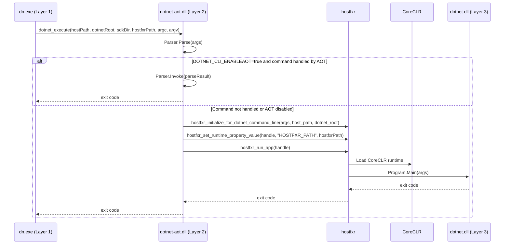
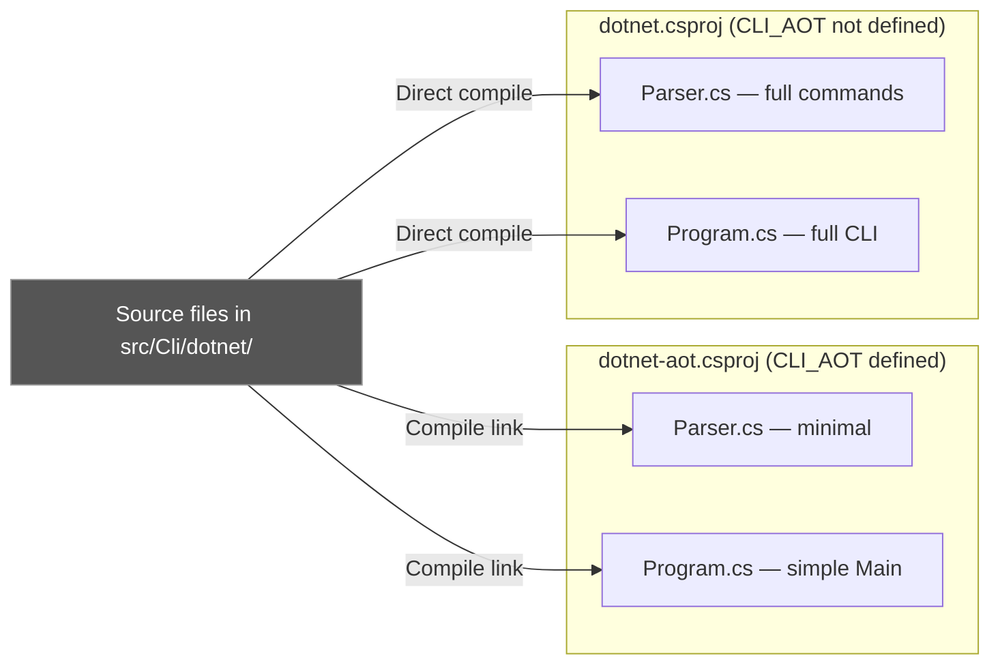
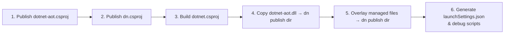
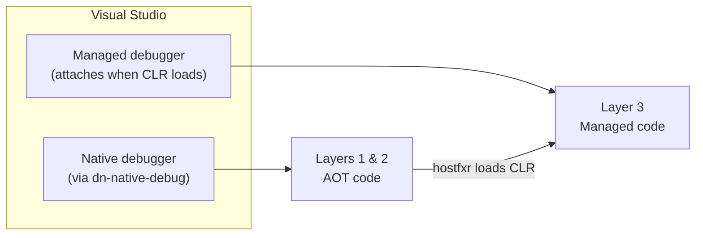
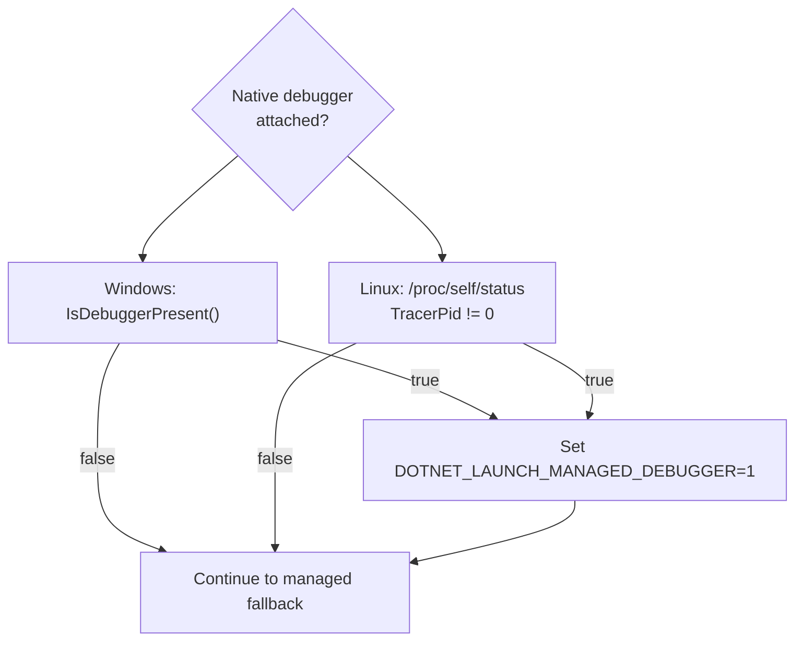

# NativeAOT Design for the .NET SDK CLI

This document describes the design for adding a NativeAOT-compiled entry point
to the .NET SDK CLI. The goal is to achieve near-instant startup for common
commands while preserving full functionality through the managed CLI.

The current implementation uses a standalone `dn.exe` host that lives alongside
the existing `dotnet` CLI. `dn.exe` emulates the muxer's `try_invoke_aot_sdk`
function — see
[dotnet/runtime#126171](https://github.com/dotnet/runtime/issues/126171). The
muxer looks for `dotnet-aot` in the resolved SDK directory and, when found,
calls `dotnet_execute` directly. `dn.exe` follows the same contract and serves
as a local development and testing entry point. The AOT fast path is gated
behind `DOTNET_CLI_ENABLEAOT=true`; when the variable is unset or false, the
bridge falls through to the managed CLI immediately.

## Motivation

The `dotnet` CLI today runs as a managed application hosted by CoreCLR. Every
invocation pays the cost of JIT compilation, type loading, and runtime
initialization — even for trivial operations like `dotnet --version`. A NativeAOT
entry point eliminates that overhead for supported commands while keeping the
full managed CLI as an automatic fallback.

## Architecture

The design uses three components arranged in layers. Each layer is compiled and
debugged differently.

| Layer | Project | Output | Compilation |
|-------|---------|--------|-------------|
| 1 — Native Host | `src/Cli/dn/` | `dn.exe` | NativeAOT (`PublishAot`, `OutputType=Exe`) |
| 2 — AOT Bridge | `src/Cli/dotnet-aot/` | `dotnet-aot.dll` / `.so` / `.dylib` | NativeAOT (`PublishAot`, `NativeLib=Shared`) |
| 3 — Managed CLI | `src/Cli/dotnet/` | `dotnet.dll` | Standard managed build |


### Layer 1 — `dn.exe` (Native Host)

A minimal NativeAOT executable whose only job is to locate the .NET installation,
resolve `hostfxr`, marshal command-line arguments into platform-native strings,
and call into Layer 2 via P/Invoke.

Key responsibilities:

- Resolve `DOTNET_ROOT` from environment variables or by walking up from the
  process path.
- Locate the highest-versioned `hostfxr` under `<DOTNET_ROOT>/host/fxr/`.
- Marshal `string[] args` to `nint*` (UTF-16 on Windows, UTF-8 on Unix).
- Call `dotnet_execute` exported from `dotnet-aot.dll`.

### Layer 2 — `dotnet-aot.dll` (AOT Bridge)

A NativeAOT shared library (`NativeLib=Shared`) that exports a single
`[UnmanagedCallersOnly]` entry point: `dotnet_execute`. This layer contains
the dual-path dispatch logic.

**Fast path** — When `DOTNET_CLI_ENABLEAOT=true`, the AOT bridge compiles a
minimal `Parser` (guarded by `#if CLI_AOT`) that handles simple commands
(`--version`, `--info`) entirely in native code. If the parser recognizes the
command, it executes immediately and returns.

**Slow path** — When `DOTNET_CLI_ENABLEAOT` is not set or the AOT parser does
not handle the command, the bridge calls `ManagedHost.RunApp()`, which uses the
hostfxr native hosting APIs (`hostfxr_initialize_for_dotnet_command_line` /
`hostfxr_set_runtime_property_value` / `hostfxr_run_app`) to bootstrap CoreCLR
and run `dotnet.dll`. The bridge passes through the `host_path`, `dotnet_root`,
and `hostfxr_path` received from the caller so that the runtime is configured
exactly as the muxer would configure it for an SDK command.



### Layer 3 — `dotnet.dll` (Managed CLI)

The existing managed CLI, unchanged. It contains all commands, telemetry,
workload management, NuGet integration, and everything else the SDK supports.
It runs on CoreCLR with full runtime capabilities (reflection, JIT, dynamic
assembly loading, hot reload).

## Source Sharing and Conditional Compilation

The `dotnet-aot` project does not duplicate source files. Instead, it links
files from `dotnet` and uses the `CLI_AOT` preprocessor constant to select
the appropriate implementation:

```xml
<!-- dotnet-aot.csproj -->
<DefineConstants>$(DefineConstants);CLI_AOT</DefineConstants>

<Compile Include="..\dotnet\Program.cs" Link="Program.cs" />
<Compile Include="..\dotnet\CommandLineInfo.cs" Link="CommandLineInfo.cs" />
<Compile Include="..\dotnet\Parser.cs" Link="Parser.cs" />
```

In the shared files:

- **`Parser.cs`** — Under `#if CLI_AOT`, defines a minimal parser with only
  `--version` and `--info`. Under `#else`, defines the full command tree.
- **`Program.cs`** — Under `#if CLI_AOT`, provides a simple `Main` that
  delegates to the AOT parser. Under `#else`, provides the full CLI entry point
  with telemetry, signal handlers, and workload checks.
- **`CommandLineInfo.cs`** — Uses `#if CLI_AOT` to substitute lightweight
  implementations for workload info, localized strings, and OS detection that
  would otherwise pull in dependencies incompatible with AOT.



## Build Process

Building for debug involves publishing two NativeAOT projects and overlaying the
managed output. The `dn.csproj` contains a `PublishAotForDebug` MSBuild target
that automates this when building inside Visual Studio:



The final publish directory contains:

```text
publish/
├── dn.exe                    ← Layer 1 (native)
├── dn.pdb                    ← Native debug symbols for Layer 1
├── dotnet-aot.dll            ← Layer 2 (native shared lib)
├── dotnet-aot.pdb            ← Native debug symbols for Layer 2
├── dotnet.dll                ← Layer 3 (managed)
├── dotnet.pdb                ← Managed debug symbols for Layer 3
├── dotnet.runtimeconfig.json ← Runtime config for hosting Layer 3
└── ...                       ← Other managed assemblies
```

For command-line builds, use the VS Code tasks or run the publish steps
manually:

```bash
# Publish the AOT shared library
dotnet publish src/Cli/dotnet-aot/dotnet-aot.csproj -r win-x64 -c Debug

# Publish the AOT host executable
dotnet publish src/Cli/dn/dn.csproj -r win-x64 -c Debug

# Build the managed CLI
dotnet build src/Cli/dotnet/dotnet.csproj -c Debug

# Copy artifacts into the dn publish directory
cp artifacts/bin/dotnet-aot/Debug/<tfm>/win-x64/publish/dotnet-aot.dll \
   artifacts/bin/dn/Debug/<tfm>/win-x64/publish/
cp -r artifacts/bin/dotnet/Debug/<tfm>/* \
   artifacts/bin/dn/Debug/<tfm>/win-x64/publish/
```

## Debugging

Debugging this architecture requires understanding which debugger engine works
with which layer. The key constraint: **NativeAOT output is pure native code
with no IL. Only a native debugger can bind breakpoints in Layers 1 and 2.**

### Debugger Compatibility Matrix

| What you want to debug | Debugger engine | VS project | VS Code config |
|------------------------|-----------------|------------|----------------|
| Layer 1 (`dn.exe`) | Native | `dn-native-debug.vcxproj` | `cppvsdbg` launch config |
| Layer 2 (`dotnet-aot.dll`) | Native | `dn-native-debug.vcxproj` | `cppvsdbg` launch config |
| Layer 3 (`dotnet.dll`) | Managed or mixed-mode | `dn.csproj` launch profile | `coreclr` launch config |
| Layers 1+2+3 together | Two debugger sessions | See [Mixed-mode](#mixed-mode-debugging-visual-studio) | See [VS Code mixed](#mixed-mode-vs-code) |

### Debugging in Visual Studio

#### Native debugging (Layers 1 & 2)

The `dn-native-debug.vcxproj` is a stub C++ Makefile project that exists solely
to provide an F5 launch target using the native debugger engine
(`WindowsLocalDebugger`). It performs no C++ compilation.

1. Open the solution (`cli.slnf` or `sdk.slnx`) in Visual Studio.
2. Set **dn-native-debug** as the startup project.
3. Set breakpoints in AOT source files (`NativeEntryPoint.cs`, `ManagedHost.cs`,
   `Program.cs` under `#if CLI_AOT`, etc.).
4. Press **F5**.

The native debugger reads the PDB generated by ILC and maps C# source lines to
native addresses. Breakpoints bind correctly in all AOT-compiled code.

> **Why not use `launchSettings.json` with `nativeDebugging: true`?**
> That flag enables *mixed-mode* debugging where the managed debugger is primary
> and a native debugger is attached as an add-on. But there is no CLR loaded yet
> in Layers 1 and 2, so the managed engine finds nothing to attach to and C#
> breakpoints in AOT code won't bind.

#### Alternative: `devenv /debugexe`

The build generates a `debug-dn.cmd` script that launches the published `dn.exe`
directly under Visual Studio's native debugger:

```cmd
set DOTNET_ROOT=<repo>\.dotnet
devenv /debugexe "<publish-dir>\dn.exe" --info
```

This opens a new VS instance with the native debugger attached. Set breakpoints
in the Source Files view and press F5.

#### Managed debugging (Layer 3)

Use the `dn.csproj` project with its generated `launchSettings.json` profile
("Debug dn (managed path)"). This profile has `nativeDebugging: true` which
enables mixed-mode, allowing the managed debugger to attach once CoreCLR loads.

1. Set **dn** as the startup project.
2. Set breakpoints in managed source files (`Program.cs` under the non-AOT path,
   command implementations, etc.).
3. Press **F5**.

Breakpoints in managed code bind after `hostfxr_run_app` loads CoreCLR and
begins executing `dotnet.dll`.

#### Mixed-mode debugging (Visual Studio)

To debug across all three layers in a single session:



1. Set **dn-native-debug** as startup project and press F5 (native debugger).
2. When execution reaches `ManagedHost.RunApp()` and the CLR is loaded, use
   **Debug → Attach to Process** to attach the managed debugger to the same
   process.

Alternatively, the AOT bridge automatically detects a native debugger and sets
`DOTNET_LAUNCH_MANAGED_DEBUGGER=1`, which signals the managed code to call
`Debugger.Launch()` — prompting you to attach a managed debugger at CLR startup.

### Debugging in VS Code

#### Native debugging (Layers 1 & 2)

Use the C/C++ extension (`ms-vscode.cpptools`) with a `cppvsdbg` (Windows) or
`cppdbg` (Linux/macOS) launch configuration:

```jsonc
{
    "name": "Debug dn (native)",
    "type": "cppvsdbg",       // Windows; use "cppdbg" on Linux/macOS
    "request": "launch",
    "program": "${workspaceFolder}/artifacts/bin/dn/Debug/<tfm>/win-x64/publish/dn.exe",
    "args": ["--info"],
    "cwd": "${workspaceFolder}/artifacts/bin/dn/Debug/<tfm>/win-x64/publish",
    "environment": [
        { "name": "DOTNET_ROOT", "value": "${workspaceFolder}/.dotnet" }
    ],
    "symbolSearchPath": "${workspaceFolder}/artifacts/bin/dn/Debug/<tfm>/win-x64/publish"
}
```

Set breakpoints in any AOT-compiled source file. The native debugger reads the
ILC-generated PDB/DWARF symbols and binds them.

#### Managed debugging (Layer 3)

Use the C# extension (`ms-dotnettools.csharp`) with a `coreclr` launch
configuration. Point it at the published `dn.exe` so it can attach once
CoreCLR loads:

```jsonc
{
    "name": "Debug dn (managed)",
    "type": "coreclr",
    "request": "launch",
    "program": "${workspaceFolder}/artifacts/bin/dn/Debug/<tfm>/win-x64/publish/dn.exe",
    "args": ["build"],
    "cwd": "${workspaceFolder}",
    "env": {
        "DOTNET_ROOT": "${workspaceFolder}/.dotnet"
    }
}
```

> **Caveat**: The managed debugger will not break on anything until CoreCLR is
> loaded by `hostfxr`. Breakpoints in Layers 1 and 2 will be skipped silently.

#### Mixed-mode (VS Code)

VS Code does not support true mixed-mode debugging in a single session. The
workaround is to run two separate debug sessions:

1. Launch with `cppvsdbg` for native breakpoints in Layers 1 & 2.
2. Separately, attach with `coreclr` after the CLR loads for Layer 3 breakpoints.

Use the `DOTNET_LAUNCH_MANAGED_DEBUGGER` mechanism: the AOT bridge detects the
native debugger and sets the environment variable, causing the managed path to
call `Debugger.Launch()`. This gives you a window to attach the managed debugger.

### Debugger Detection

The AOT bridge (`NativeEntryPoint.cs`) detects whether a native debugger is
attached before falling through to the managed path:



When the managed CLI starts and sees `DOTNET_LAUNCH_MANAGED_DEBUGGER=1`, it
calls `System.Diagnostics.Debugger.Launch()`, which triggers the JIT debugger
dialog (or auto-attaches in configured environments).

## Limitations and Caveats

### AOT Layer Limitations

- **No reflection** — AOT code cannot use unbounded reflection. The AOT parser
  must be manually maintained.
- **No dynamic loading** — Assemblies cannot be loaded at runtime in AOT layers.
- **Limited exception inspection** — In the native debugger, managed exception
  types appear with mangled names (e.g., `S_P_CoreLib_System_Exception`).
  Inspecting exception messages requires casting pointers manually.
- **No Edit and Continue** — Not available for AOT-compiled code.
- **No Hot Reload** — Not available for AOT-compiled code.

### Debugging Limitations

- **No single-session mixed-mode in VS Code** — Must use two debugger sessions.
- **Managed breakpoints don't bind in AOT code** — The managed debugger engine
  (`coreclr`) cannot see code that has no IL. Breakpoints set via the managed
  debugger in files compiled by Layer 2 will not hit.
- **Breakpoint binding delay for Layer 3** — Managed breakpoints only bind after
  `hostfxr_run_app` loads CoreCLR. Before that, they appear as hollow circles.
- **Generic type inspection** — Generic types in AOT code have mangled names
  that include instantiation info, making Watch/Locals windows harder to read.
- **Stepping across the hosting boundary** — You cannot seamlessly step from
  AOT code into managed code. The hostfxr call is opaque; you need to set a
  breakpoint on the managed side and continue.

### Platform-Specific Notes

| Platform | Native Debugger | Symbol Format | Notes |
|----------|-----------------|---------------|-------|
| Windows | `cppvsdbg` / WinDbg | `.pdb` (native) | Full VS integration via vcxproj |
| Linux | `cppdbg` (gdb/lldb) | DWARF (`.dbg`) | Ensure `.dbg` is alongside binary |
| macOS | `cppdbg` (lldb) | `.dSYM` directory | `dsymutil` runs automatically |

## Future Work

- **Muxer integration** — The muxer's `try_invoke_aot_sdk` function
  ([dotnet/runtime#126171](https://github.com/dotnet/runtime/issues/126171))
  already calls `dotnet_execute` from the resolved SDK directory, passing
  `host_path`, `dotnet_root`, `sdk_dir`, and `hostfxr_path`. `dn.exe`
  emulates this same contract for local development and testing.
- **Remove AOT commands from managed package** — After the AOT path is
  validated and shipping, the `#if CLI_AOT` implementations in `Parser.cs`
  and `Program.cs` can be removed from the managed `dotnet.dll` build.
- **Expand AOT-handled commands** — Move more commands into the AOT parser to
  reduce fallback frequency.
- **Async managed host initialization** — Start loading CoreCLR while parsing
  to hide runtime startup latency on fallback paths.
- **Single-binary distribution** — Explore embedding `dotnet-aot.dll` as a
  static library linked directly into `dn.exe` (or the muxer).
