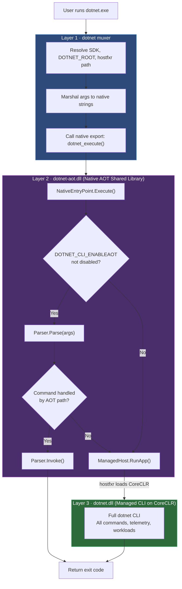
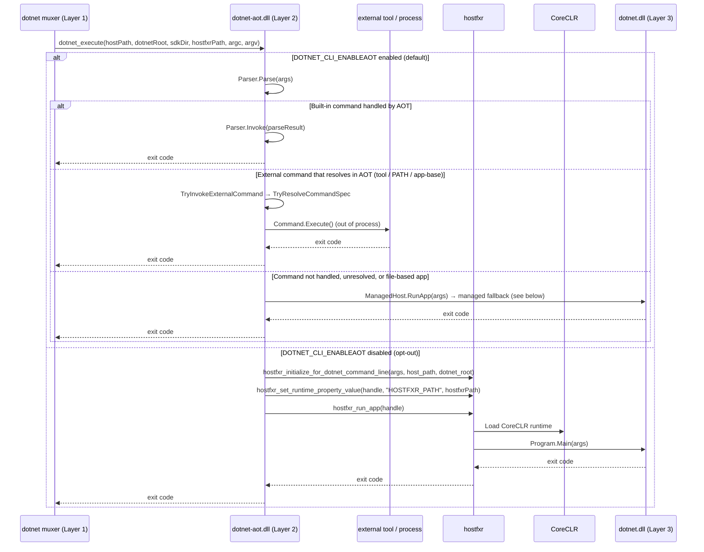
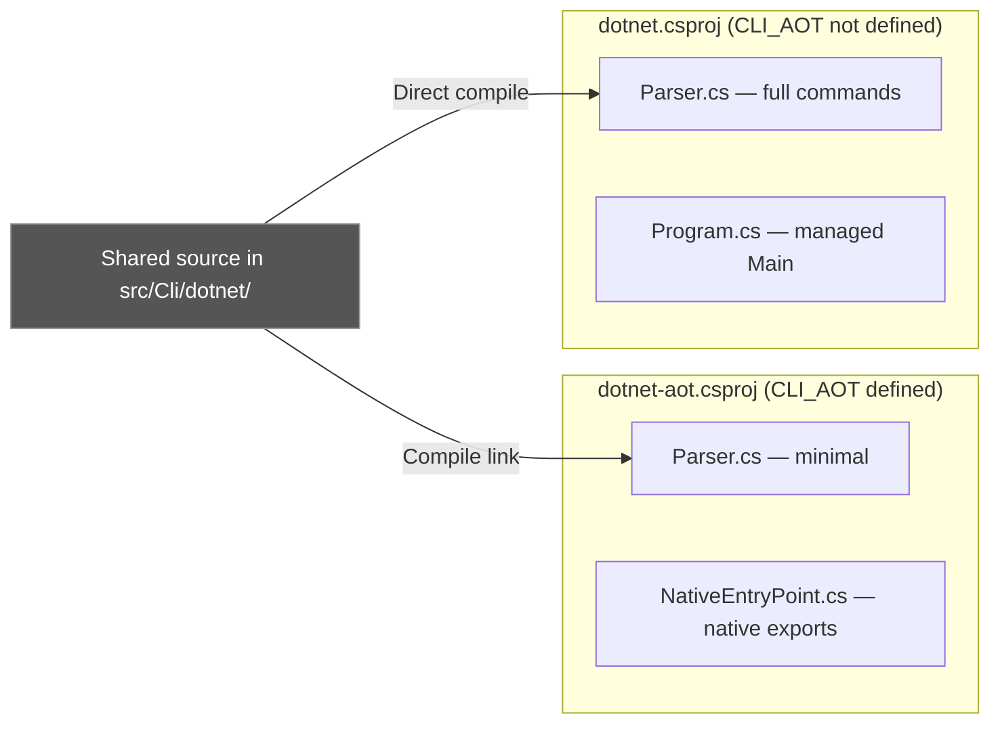
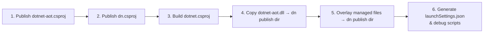
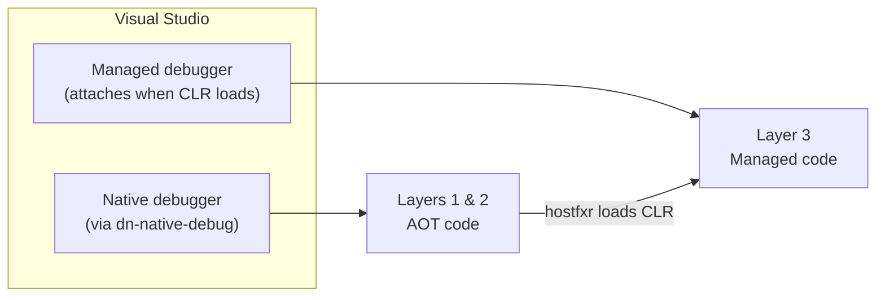
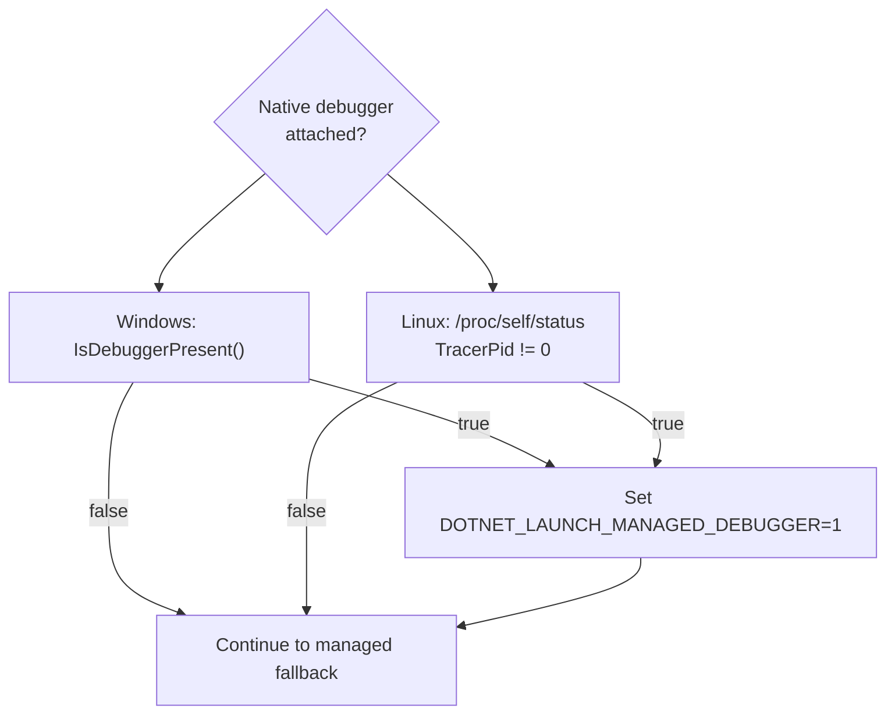

# NativeAOT Design for the .NET SDK CLI

This document describes the design for adding a NativeAOT-compiled entry point
to the .NET SDK CLI. The goal is to achieve near-instant startup for common
commands while preserving full functionality through the managed CLI.

The `dotnet` muxer invokes the Native AOT CLI through its `try_invoke_aot_sdk`
function — see
[dotnet/runtime#126171](https://github.com/dotnet/runtime/issues/126171). The
muxer looks for `dotnet-aot` in the resolved SDK directory and, when found,
calls `dotnet_execute` directly. The standalone `dn.exe` host follows the same
contract for focused bridge development and debugging, but full redist
`dotnet.exe` is the authoritative integration entry point. The AOT fast path is
enabled by default on all platforms (see [Opting out](#opting-out-dotnet_cli_enableaot));
setting `DOTNET_CLI_ENABLEAOT=false` (or `0`/`no`/`off`) opts out, and the bridge
falls through to the managed CLI immediately.

## Opting out (`DOTNET_CLI_ENABLEAOT`)

The AOT command-handling fast path is **enabled by default on all platforms**. It
preserves command semantics and transparently defers to the managed CLI for unsupported
functionality. Restore-based AOT commands run the same background workload advertising-
manifest and SDK vulnerability-cache refreshes, and display the same workload update
notification, as the managed CLI. The native closure contains only the workload
advertising services; workload installation, repair, and elevated MSI IPC still defer to
the managed CLI.

If you need to bypass the AOT path entirely — for example to diagnose a suspected parity
issue — set the `DOTNET_CLI_ENABLEAOT` environment variable to a falsy value before
invoking `dotnet`:

- Disable: `false`, `0`, `no`, or `off`
- Enable: `true`, `1`, `yes`, or `on`
- Unset (default): enabled

When disabled, every invocation is routed straight to the managed CLI, exactly as it
behaved before the AOT fast path was enabled by default.

## Motivation

The `dotnet` CLI today runs as a managed application hosted by CoreCLR. Every
invocation pays the cost of JIT compilation, type loading, and runtime
initialization — even for trivial operations like `dotnet --version`. A NativeAOT
entry point eliminates that overhead for supported commands while keeping the
full managed CLI as an automatic fallback.

## Architecture

The design uses three components arranged in layers. Each layer is compiled and
debugged differently.

| Layer | Project | Output | Compilation |
|-------|---------|--------|-------------|
| 1 — Native Host | `dotnet` muxer (`src/native/corehost`) | `dotnet.exe` | Native host |
| 2 — AOT Bridge | `src/Cli/dotnet-aot/` | `dotnet-aot.dll` / `.so` / `.dylib` | NativeAOT (`PublishAot`, `NativeLib=Shared`) |
| 3 — Managed CLI | `src/Cli/dotnet/` | `dotnet.dll` | Standard managed build |



### Layer 1 — `dotnet` muxer (Native Host)

The existing native muxer resolves the .NET installation and selected SDK, then
loads Layer 2 and calls its native export. `src/Cli/dn` provides a smaller
development host for debugging the same contract, but is not the end-to-end test
harness.

Key responsibilities:

- Resolve `DOTNET_ROOT` from environment variables or by walking up from the
  process path.
- Locate the highest-versioned `hostfxr` under `<DOTNET_ROOT>/host/fxr/`.
- Marshal `string[] args` to `nint*` (UTF-16 on Windows, UTF-8 on Unix).
- Call `dotnet_execute` exported from `dotnet-aot.dll`.

### Layer 2 — `dotnet-aot.dll` (AOT Bridge)

A NativeAOT shared library (`NativeLib=Shared`) that exports a single
`[UnmanagedCallersOnly]` entry point: `dotnet_execute`. This layer contains
the dual-path dispatch logic.

**Fast path** — Unless `DOTNET_CLI_ENABLEAOT` is explicitly disabled, the AOT
bridge builds the
**full** command tree (the same `DotNetCommandDefinition` used by the managed
CLI) so that parsing and `--help` match the managed CLI exactly. Commands that
can run entirely in AOT (`--version`, `--info`, and the AOT-capable `sln`
subcommands, plus `build`, `restore`, `pack`, and `publish` setup) execute immediately
and return.
Every other built-in command is wired with a fallback action that throws
`CommandNotAvailableInAotException`;
the bridge catches it (and any unexpected parse-time failure) and transparently
falls through to the managed CLI.

**External command path** — When the parsed command is not a built-in
(`parseResult.RequiresManagedCommandResolution()`), it is either an external
tool (`dotnet ef`, a global or local tool, a command on the `PATH`, an app-base
command, ...) or an implicit file-based app (`dotnet app.cs`). The bridge's
`TryInvokeExternalCommand` resolves these with the same AOT-safe resolver set
the managed CLI uses — minus the MSBuild/NuGet project-tools resolver — via
`CommandResolver.TryResolveCommandSpec(new DefaultCommandResolverPolicy(), ...)`,
then invokes the resolved `CommandSpec` out-of-process through
`CommandFactoryUsingResolver` + `Command.Execute()`. The resolution step is
side-effect free, so the bridge defers to the managed CLI whenever it cannot
handle the invocation: file-based apps (handled by the managed `run` pipeline),
commands that only the full project-tools resolver can find, anything that does
not resolve, or any resolution error. Because the managed CLI re-resolves with
its full resolver set, deferral produces identical user-facing behavior. Out-of-
process invocation only happens after a non-null spec, so a command is never
executed twice.

**MSBuild evaluation and project commands** — The AOT bridge registers the
SDK-shipped workload and NuGet SDK resolvers through MSBuild's static registration APIs.
For a physical project, solution, current directory, or file-based app passed to
`dotnet build`, `dotnet restore`, `dotnet pack`, or `dotnet publish`, it forwards the
command target to the selected SDK's `MSBuild.dll` out of process. Build, pack, and publish
also forward restore when requested; pack and publish first evaluate the project properties
needed to honor `PackRelease` or `PublishRelease`. File-based apps without `#:` directives use
an AOT-safe subset of the existing virtual-project builder for evaluation, including SDK
imports and implicit files such as `Directory.Build.props`; compilation and
directive-aware project construction still defer to the managed CLI. SDK-relative paths
(`MSBuild.dll`, `Sdks`,
`MSBuildExtensionsPath`, and the telemetry logger) come from
`SdkPaths.SdkDirectory`, not `AppContext.BaseDirectory`. `.nuspec` inputs also defer
because they use the in-process NuGet pack engine. The shared `RestoringCommand` starts
workload advertising and vulnerability-cache maintenance in both modes. Its AOT closure
reuses the existing NuGet downloader, file-based and administrative-MSI manifest
extraction, and read-only workload records without linking workload install/repair or
elevated MSI IPC.

**Slow path** — When `DOTNET_CLI_ENABLEAOT` is disabled (`false`/`0`/`no`/`off`)
or the AOT bridge does
not handle the command, the bridge calls `ManagedHost.RunApp()`, which uses the
hostfxr native hosting APIs (`hostfxr_initialize_for_dotnet_command_line` /
`hostfxr_set_runtime_property_value` / `hostfxr_run_app`) to bootstrap CoreCLR
and run `dotnet.dll`. The bridge passes through the `host_path`, `dotnet_root`,
and `hostfxr_path` received from the caller so that the runtime is configured
exactly as the muxer would configure it for an SDK command.



### Layer 3 — `dotnet.dll` (Managed CLI)

The existing managed CLI, unchanged. It contains all commands, telemetry,
workload management, NuGet integration, and everything else the SDK supports.
It runs on CoreCLR with full runtime capabilities (reflection, JIT, dynamic
assembly loading, hot reload).

## Source Sharing and Conditional Compilation

The `dotnet-aot` project does not duplicate source files. Instead, it links
files from `dotnet` and uses the `CLI_AOT` preprocessor constant to select
the appropriate implementation:

```xml
<!-- dotnet-aot.csproj -->
<DefineConstants>$(DefineConstants);CLI_AOT</DefineConstants>

<Compile Include="..\dotnet\Parser.cs" Link="Parser.cs" />
<Compile Include="..\dotnet\ParserOptionActions.cs" Link="ParserOptionActions.cs" />
```

In the shared files:

- **`Parser.cs`** — A single shared `Parser` class builds the same full
  `DotNetCommandDefinition` tree in both modes. Only the action wiring differs,
  isolated to small inline `#if CLI_AOT` regions: the managed build wires the
  real command handlers, while the AOT build attaches a managed-fallback handler
  to every command (overriding it with real implementations where AOT can run
  the command, e.g. `sln`). The help writer (`DotnetHelpBuilder`) has no
  conditional compilation: help for the external-tool commands
  (msbuild/nuget/vstest/format/fsi) renders from AOT because those forwarding
  apps use AOT-friendly out-of-process codepaths under `#if CLI_AOT`.
- **`ParserOptionActions.cs`** — The shared `--help`/`--version`/`--info` option
  actions. `PrintInfoAction` reports the workload and MSBuild details in both modes;
  the AOT build substitutes its runtime RID and resolved versioned SDK directory
  where the managed implementation relies on hostfxr state. The diagnostics and
  `--cli-schema` actions are `#if !CLI_AOT` (the AOT build defers those to the
  managed CLI).

The two projects have **different entry-point shapes and do not share a
`Program.cs`**:

- **`dotnet-aot`** is a `NativeLib=Shared` library: its entry points are the
  `[UnmanagedCallersOnly]` exports in `NativeEntryPoint.cs` (e.g.
  `dotnet_execute`), which build and invoke the shared `Parser` and drive the
  per-invocation telemetry/signal/first-run setup. It has no managed `Main` and
  does not compile any `Program.cs`.
- **`src/Cli/dotnet/Program.cs`** — the managed CLI entry point with telemetry,
  signal handlers, and workload checks. It carries no `#if CLI_AOT` branches and
  is not linked into the AOT build. (The `hostfxr_run_app` fallback above invokes
  *this* `Program.Main` from the managed `dotnet.dll` at runtime — not from the
  AOT binary.)

Code that genuinely needs to be identical between the two entry points lives in
`src/Cli/dotnet/CommandInvocation.cs` (`ExecuteInternalCommand`), which both
`Program.cs` (managed) and `NativeEntryPoint.cs` (AOT) call.



## Build Process

Building for debug involves publishing two NativeAOT projects and overlaying the
managed output. The `dn.csproj` contains a `PublishAotForDebug` MSBuild target
that automates this when building inside Visual Studio:



The final publish directory contains:

```text
publish/
├── dn.exe                    ← Layer 1 (native)
├── dn.pdb                    ← Native debug symbols for Layer 1
├── dotnet-aot.dll            ← Layer 2 (native shared lib)
├── dotnet-aot.pdb            ← Native debug symbols for Layer 2
├── dotnet.dll                ← Layer 3 (managed)
├── dotnet.pdb                ← Managed debug symbols for Layer 3
├── dotnet.runtimeconfig.json ← Runtime config for hosting Layer 3
└── ...                       ← Other managed assemblies
```

For command-line builds, use the VS Code tasks or run the publish steps
manually:

```bash
# Publish the AOT shared library
dotnet publish src/Cli/dotnet-aot/dotnet-aot.csproj -r win-x64 -c Debug

# Publish the AOT host executable
dotnet publish src/Cli/dn/dn.csproj -r win-x64 -c Debug

# Build the managed CLI
dotnet build src/Cli/dotnet/dotnet.csproj -c Debug

# Copy artifacts into the dn publish directory
cp artifacts/bin/dotnet-aot/Debug/<tfm>/win-x64/publish/dotnet-aot.dll \
   artifacts/bin/dn/Debug/<tfm>/win-x64/publish/
cp -r artifacts/bin/dotnet/Debug/<tfm>/* \
   artifacts/bin/dn/Debug/<tfm>/win-x64/publish/
```

## Debugging

Debugging this architecture requires understanding which debugger engine works
with which layer. The key constraint: **NativeAOT output is pure native code
with no IL. Only a native debugger can bind breakpoints in Layers 1 and 2.**

### Debugger Compatibility Matrix

| What you want to debug | Debugger engine | VS project | VS Code config |
|------------------------|-----------------|------------|----------------|
| Layer 1 (`dn.exe`) | Native | `dn-native-debug.vcxproj` | `cppvsdbg` launch config |
| Layer 2 (`dotnet-aot.dll`) | Native | `dn-native-debug.vcxproj` | `cppvsdbg` launch config |
| Layer 3 (`dotnet.dll`) | Managed or mixed-mode | `dn.csproj` launch profile | `coreclr` launch config |
| Layers 1+2+3 together | Two debugger sessions | See [Mixed-mode](#mixed-mode-debugging-visual-studio) | See [VS Code mixed](#mixed-mode-vs-code) |

### Debugging in Visual Studio

#### Native debugging (Layers 1 & 2)

The `dn-native-debug.vcxproj` is a stub C++ Makefile project that exists solely
to provide an F5 launch target using the native debugger engine
(`WindowsLocalDebugger`). It performs no C++ compilation.

1. Open the solution (`cli.slnf` or `sdk.slnx`) in Visual Studio.
2. Set **dn-native-debug** as the startup project.
3. Set breakpoints in AOT source files (`NativeEntryPoint.cs`, `ManagedHost.cs`,
   `Parser.cs`, etc.).
4. Press **F5**.

The native debugger reads the PDB generated by ILC and maps C# source lines to
native addresses. Breakpoints bind correctly in all AOT-compiled code.

> **Why not use `launchSettings.json` with `nativeDebugging: true`?**
> That flag enables *mixed-mode* debugging where the managed debugger is primary
> and a native debugger is attached as an add-on. But there is no CLR loaded yet
> in Layers 1 and 2, so the managed engine finds nothing to attach to and C#
> breakpoints in AOT code won't bind.

#### Alternative: `devenv /debugexe`

The build generates a `debug-dn.cmd` script that launches the published `dn.exe`
directly under Visual Studio's native debugger:

```cmd
set DOTNET_ROOT=<repo>\.dotnet
devenv /debugexe "<publish-dir>\dn.exe" --info
```

This opens a new VS instance with the native debugger attached. Set breakpoints
in the Source Files view and press F5.

#### Managed debugging (Layer 3)

Use the `dn.csproj` project with its generated `launchSettings.json` profile
("Debug dn (managed path)"). This profile has `nativeDebugging: true` which
enables mixed-mode, allowing the managed debugger to attach once CoreCLR loads.

1. Set **dn** as the startup project.
2. Set breakpoints in managed source files (`Program.cs` under the non-AOT path,
   command implementations, etc.).
3. Press **F5**.

Breakpoints in managed code bind after `hostfxr_run_app` loads CoreCLR and
begins executing `dotnet.dll`.

#### Mixed-mode debugging (Visual Studio)

To debug across all three layers in a single session:



1. Set **dn-native-debug** as startup project and press F5 (native debugger).
2. When execution reaches `ManagedHost.RunApp()` and the CLR is loaded, use
   **Debug → Attach to Process** to attach the managed debugger to the same
   process.

Alternatively, the AOT bridge automatically detects a native debugger and sets
`DOTNET_LAUNCH_MANAGED_DEBUGGER=1`, which signals the managed code to call
`Debugger.Launch()` — prompting you to attach a managed debugger at CLR startup.

### Debugging in VS Code

#### Native debugging (Layers 1 & 2)

Use the C/C++ extension (`ms-vscode.cpptools`) with a `cppvsdbg` (Windows) or
`cppdbg` (Linux/macOS) launch configuration:

```jsonc
{
    "name": "Debug dn (native)",
    "type": "cppvsdbg",       // Windows; use "cppdbg" on Linux/macOS
    "request": "launch",
    "program": "${workspaceFolder}/artifacts/bin/dn/Debug/<tfm>/win-x64/publish/dn.exe",
    "args": ["--info"],
    "cwd": "${workspaceFolder}/artifacts/bin/dn/Debug/<tfm>/win-x64/publish",
    "environment": [
        { "name": "DOTNET_ROOT", "value": "${workspaceFolder}/.dotnet" }
    ],
    "symbolSearchPath": "${workspaceFolder}/artifacts/bin/dn/Debug/<tfm>/win-x64/publish"
}
```

Set breakpoints in any AOT-compiled source file. The native debugger reads the
ILC-generated PDB/DWARF symbols and binds them.

#### Managed debugging (Layer 3)

Use the C# extension (`ms-dotnettools.csharp`) with a `coreclr` launch
configuration. Point it at the published `dn.exe` so it can attach once
CoreCLR loads:

```jsonc
{
    "name": "Debug dn (managed)",
    "type": "coreclr",
    "request": "launch",
    "program": "${workspaceFolder}/artifacts/bin/dn/Debug/<tfm>/win-x64/publish/dn.exe",
    "args": ["build"],
    "cwd": "${workspaceFolder}",
    "env": {
        "DOTNET_ROOT": "${workspaceFolder}/.dotnet"
    }
}
```

> **Caveat**: The managed debugger will not break on anything until CoreCLR is
> loaded by `hostfxr`. Breakpoints in Layers 1 and 2 will be skipped silently.

#### Mixed-mode (VS Code)

VS Code does not support true mixed-mode debugging in a single session. The
workaround is to run two separate debug sessions:

1. Launch with `cppvsdbg` for native breakpoints in Layers 1 & 2.
2. Separately, attach with `coreclr` after the CLR loads for Layer 3 breakpoints.

Use the `DOTNET_LAUNCH_MANAGED_DEBUGGER` mechanism: the AOT bridge detects the
native debugger and sets the environment variable, causing the managed path to
call `Debugger.Launch()`. This gives you a window to attach the managed debugger.

### Debugger Detection

The AOT bridge (`NativeEntryPoint.cs`) detects whether a native debugger is
attached before falling through to the managed path:



When the managed CLI starts and sees `DOTNET_LAUNCH_MANAGED_DEBUGGER=1`, it
calls `System.Diagnostics.Debugger.Launch()`, which triggers the JIT debugger
dialog (or auto-attaches in configured environments).

## Limitations and Caveats

### AOT Layer Limitations

- **No reflection** — AOT code cannot use unbounded reflection. The AOT parser
  must be manually maintained.
- **No dynamic loading** — Assemblies cannot be loaded at runtime in AOT layers.
- **Limited exception inspection** — In the native debugger, managed exception
  types appear with mangled names (e.g., `S_P_CoreLib_System_Exception`).
  Inspecting exception messages requires casting pointers manually.
- **No Edit and Continue** — Not available for AOT-compiled code.
- **No Hot Reload** — Not available for AOT-compiled code.

### Debugging Limitations

- **No single-session mixed-mode in VS Code** — Must use two debugger sessions.
- **Managed breakpoints don't bind in AOT code** — The managed debugger engine
  (`coreclr`) cannot see code that has no IL. Breakpoints set via the managed
  debugger in files compiled by Layer 2 will not hit.
- **Breakpoint binding delay for Layer 3** — Managed breakpoints only bind after
  `hostfxr_run_app` loads CoreCLR. Before that, they appear as hollow circles.
- **Generic type inspection** — Generic types in AOT code have mangled names
  that include instantiation info, making Watch/Locals windows harder to read.
- **Stepping across the hosting boundary** — You cannot seamlessly step from
  AOT code into managed code. The hostfxr call is opaque; you need to set a
  breakpoint on the managed side and continue.

### Platform-Specific Notes

| Platform | Native Debugger | Symbol Format | Notes |
|----------|-----------------|---------------|-------|
| Windows | `cppvsdbg` / WinDbg | `.pdb` (native) | Full VS integration via vcxproj |
| Linux | `cppdbg` (gdb/lldb) | DWARF (`.dbg`) | Ensure `.dbg` is alongside binary |
| macOS | `cppdbg` (lldb) | `.dSYM` directory | `dsymutil` runs automatically |

## Future Work

- **Broaden muxer-path coverage** — Continue validating new AOT command handlers
  through a full redist `dotnet.exe`, using `dn.exe` only for focused native-host
  development and debugging.
- **Remove AOT commands from managed package** — After the AOT path is
  validated and shipping, the `#if CLI_AOT` implementations in `Parser.cs`
  can be removed from the managed `dotnet.dll` build.
- **Expand AOT-handled commands** — Move more commands into the AOT parser to
  reduce fallback frequency.
- **Async managed host initialization** — Start loading CoreCLR while parsing
  to hide runtime startup latency on fallback paths.
- **Single-binary distribution** — Explore embedding `dotnet-aot.dll` as a
  static library linked directly into `dn.exe` (or the muxer).
