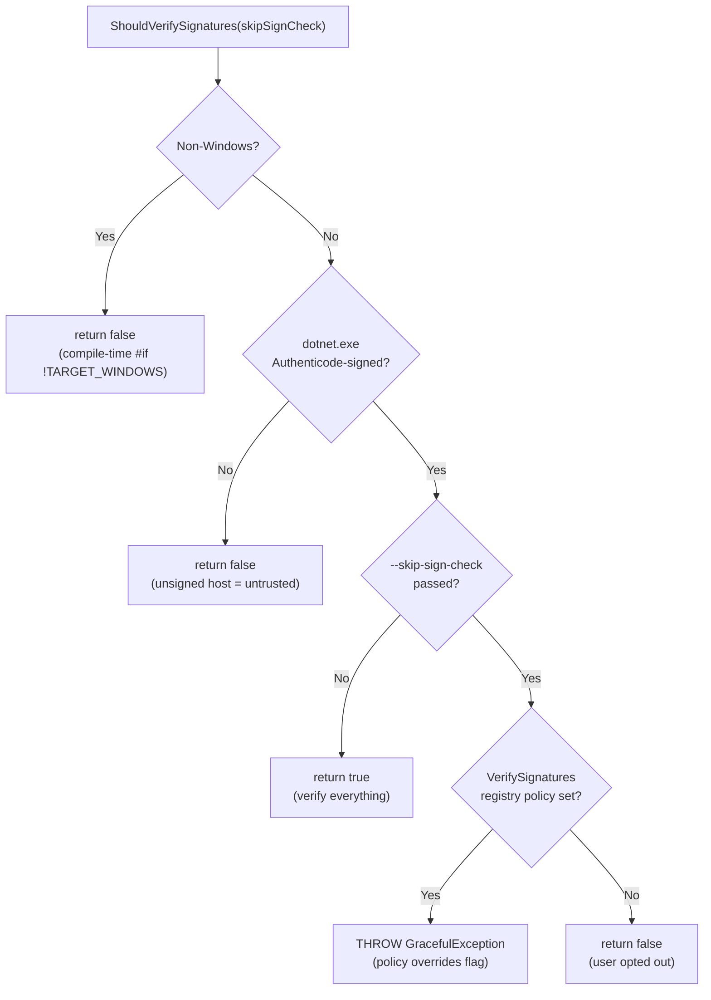

# Workload Signing Verification

## Overview

Workload commands use **two independent signature verification systems**:

| Layer | What is verified | Technology | Platform |
|-------|-----------------|------------|----------|
| **NuGet package signing** | `.nupkg` files from NuGet feeds | `NuGetPackageDownloader` + `FirstPartyNuGetPackageSigningVerifier` | Windows only |
| **MSI Authenticode signing** | `.msi` files extracted from NuGet packages | `WinVerifyTrust` + Microsoft root cert chain | Windows only |

**Both layers are Windows-only for workloads.** On non-Windows, `ShouldVerifySignatures()`
returns `false` at compile time and neither layer runs.

For details on how `NuGetPackageDownloader` performs signature verification (platform gate,
verification modes, TRP certificate bundles), see
[NUGET-SIGNATURE-VERIFICATION.md](../../NugetPackageDownloader/NUGET-SIGNATURE-VERIFICATION.md).

### Why verification is gated on the host being signed

Signature verification is skipped when the dotnet host (`dotnet.exe`) is unsigned. Unsigned
hosts indicate a locally-built SDK, preview build, or source-build — environments where
workload packages are also likely to be unsigned. Enforcing downstream signature checks when
the host itself is unsigned would break these development workflows without providing meaningful
security benefit.

When the host *is* signed (i.e., an official Microsoft release), verification is enabled
by default. The `--skip-sign-check` flag allows users to opt out when needed (e.g., private
feeds), unless the `VerifySignatures` registry policy is set by an administrator.

### Why workloads use first-party verification

Workloads are selected from a fixed list provided by the .NET SDK. If the SDK itself is signed
by Microsoft, there is an implicit chain of trust: the user chose a workload from Microsoft's
list, so the workload packages should also come from Microsoft. This justifies the first-party
certificate check (`Verify()`) that regular NuGet restore does not perform.

## Platform Support

### Windows
Both NuGet and MSI verification are fully supported. `ShouldVerifySignatures()` checks whether
the dotnet host is Authenticode-signed (via CsWin32 APIs) and respects `--skip-sign-check`
and the `VerifySignatures` registry policy.

### Linux and macOS
Workload signature verification is **not enforced**. `ShouldVerifySignatures()` returns `false`
at compile time (`#if !TARGET_WINDOWS`), so workload callers never request verification.
Three reasons:

1. **No host-signed check.** `SignCheck.IsDotNetSigned()` uses Windows Authenticode APIs
   (Win32) with no Linux/macOS equivalent. Without this check, there is no trust anchor.
2. **TRP certificate bundle lag.** On Linux, NuGet verifies signatures using root certificate
   bundles shipped as point-in-time snapshots in the SDK. These can lag behind newly-added
   roots, causing verification to fail for valid packages.
3. **No fallback layer.** On non-Windows, workload packs are file-based (no MSI), so there is
   no second verification layer.

> The `NuGetPackageDownloader` has its own platform gate that enables verification on Linux
> (by default) and macOS (opt-in) for non-workload callers like `dotnet tool install`. Workload
> callers bypass this gate because `ShouldVerifySignatures()` already returned `false`.
> See [NUGET-SIGNATURE-VERIFICATION.md](../../NugetPackageDownloader/NUGET-SIGNATURE-VERIFICATION.md#platform-gate).

## Decision Flow

### `WorkloadUtilities.ShouldVerifySignatures()`

Two overloads:
- `ShouldVerifySignatures(bool skipSignCheck)` — for user-facing commands with `--skip-sign-check`
- `ShouldVerifySignatures()` — parameterless, for non-interactive code paths; equivalent to
  `ShouldVerifySignatures(false)`

The result sets `VerifySignatures` in `WorkloadCommandBase`, which is passed to **both** the
NuGet downloader (as `verifySignatures`) and the installer factory (as `verifyMsiSignature`):

### Registry Policies (Windows only)

`HKLM\SOFTWARE\Policies\Microsoft\dotnet\Workloads`:

| Value Name | Effect |
|-----------|--------|
| `VerifySignatures` (DWORD ≠ 0) | Prevents `--skip-sign-check` from disabling verification |
| `AllowOnlineRevocationChecks` (DWORD = 0) | Restricts CRL checks to local cache only |

## NuGet Verification (Layer 1)

Workload commands create the NuGet downloader via `CreateForWorkloads(VerifyNuGetSignatures)`.
When `VerifyNuGetSignatures` is `true` (Windows with signed host), `VerifySigning()` runs after
each download in **strict** mode — requiring both a valid NuGet signature and a Microsoft
author certificate. See
[NUGET-SIGNATURE-VERIFICATION.md](../../NugetPackageDownloader/NUGET-SIGNATURE-VERIFICATION.md)
for the full verification pipeline.

## MSI Authenticode Verification (Layer 2, Windows only)

### When it runs
When retrieving MSI payloads from the cache in `MsiPackageCache.TryGetPayloadFromCache()`,
before any MSI installation or repair.

### What it checks (two sequential steps)
1. **`Signature.IsAuthenticodeSigned()`** — `WinVerifyTrust` with full chain and revocation check.
2. **`Signature.HasMicrosoftTrustedRoot()`** — certificate chain terminates in a Microsoft root
   (`CERT_CHAIN_POLICY_MICROSOFT_ROOT`).

### `ValidateMsiDatabase()` is NOT a signature check
`NetSdkMsiInstallerClient.ValidateMsiDatabase()` calls `WindowsInstaller.VerifyPackage()` to
validate the MSI database structure (tables, columns, schema). This is a structural integrity
check, **not** a cryptographic signature check.

## Entry Points

### 1. `WorkloadCommandBase` (install/update/repair/etc.)
- `ShouldVerifySignatures(skipSignCheck)` → `VerifySignatures`
- `CreateForWorkloads(VerifySignatures)` for the NuGet downloader
- Subclasses pass `VerifySignatures` to `WorkloadInstallerFactory.GetWorkloadInstaller(verifyMsiSignature:)`

### 2. `WorkloadInfoHelper` (list/info display)
- Delegates to `ShouldVerifySignatures()` for MSI verification default
- Does not typically perform installations

### 3. `WorkloadIntegrityChecker.RunFirstUseCheck()`
- `ShouldVerifySignatures()` → `verifySignatures` (single value for both layers)
- Reinstalls existing workloads to verify integrity

### 4. `WorkloadManifestUpdater.GetInstance()` (background advertising)
- NuGet: `ShouldVerifySignatures()` (respects policy, no user flags)
- MSI: **disabled** (`false`) — only downloads advertising manifests, not MSIs

### 5. `NetSdkMsiInstallerClient.Create()` (fallback downloader)
- `CreateForWorkloads(verifyNuGetSignatures: false)` — MSI Authenticode is the primary gate

## `IsDotNetSigned()` vs. `ShouldVerifySignatures()`

- `IsDotNetSigned()` — low-level factual check: "is the host binary Authenticode-signed?"
- `ShouldVerifySignatures()` — policy decision incorporating host signing status,
  `--skip-sign-check`, and `VerifySignatures` registry policy

**All workload entry points should use `ShouldVerifySignatures()`.** `IsDotNetSigned()` is an
internal building block and should not be called directly.
