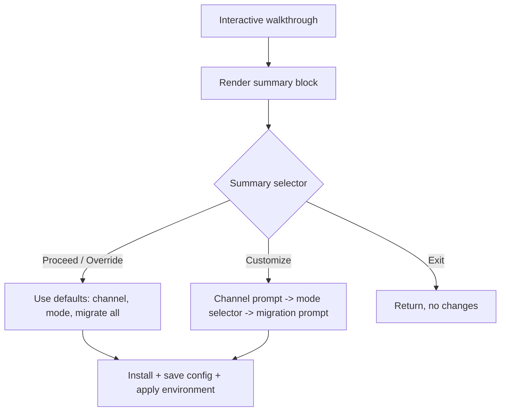

# dotnetup Init / Walkthrough Summary UX

This document describes the desired user experience (UX) of the `dotnetup`
onboarding/init flow after migrating it from a sequence of unconditional prompts
to a **summary-first** design, the decisions behind that design, and the UX
branches a customer can reach.

Tracking issue: [dotnetup: Migrate walkthrough to summary-based approach](https://github.com/dotnet/sdk/issues/53837).

## Goals

- Show the user a concise **summary of the defaults** first, then let them
  proceed, customize, or exit, instead of forcing them through every prompt.
- Let a user accept all recommended defaults with a single confirmation and
  never be prompted again (after the first interaction).
- Preserve the existing step-by-step walkthrough for users who want to
  customize their setup.
- Surface what is *already configured* (when re-running) so the user can decide
  whether to change anything.
- Reuse the existing default-resolution and install/migration logic. The summary
  flow must **not** duplicate the logic that builds install requests, resolves
  the path preference, or executes migrations.

## Vocabulary

| Term | Meaning |
| --- | --- |
| **Walkthrough / init flow** | The interactive onboarding orchestrated by `InitWorkflows.InitWalkthrough`. |
| **Path preference / Mode** | How the user accesses dotnetup-managed .NET (`PathPreference`: Isolation, Terminal Profile, Replacement). Persisted in `dotnetup.config.json`. |
| **Configured** | A `dotnetup.config.json` exists with a saved `PathPreference` (`DotnetupConfig.ReadPathPreference()` is non-null). |
| **Unconfigured** | No saved `PathPreference` (first run). |
| **Defaults** | The recommended channel, the recommended path preference, and whether to migrate the system installs or not. |

## Entry points that reach the summary

The summary selector is the new first screen of the interactive walkthrough.
The three ways to reach it are:

| Command | Condition to show the summary |
| --- | --- |
| `dotnetup` (bare) | Unconfigured **and** interactive (not CI, not redirected) **and** no explicit `--install-path` **and** not `--migrate-from-system`. |
| `dotnetup sdk install` and others | Same conditions as bare `dotnetup`. |
| `dotnetup init` | Always runs the walkthrough when interactive. `init` is the explicit "configure me" command, so it shows the summary even when already configured. |

These conditions are the existing
`InstallWorkflow.ShouldRunFirstUseOnboarding` gate for the install commands, and
the unconditional `InitWorkflows.InitWalkthrough` call for `init`:

```text
ShouldRunFirstUseOnboarding = !migrateFromSystem
    && interactive
    && installPath is null
    && DotnetupConfig.ReadPathPreference() is null
```

### Why `dotnetup init` always starts with the summary

`dotnetup init` intentionally shows the summary even when dotnetup is already
configured. This lets the user **see what they have already configured** before
deciding whether to change anything, and gives a consistent place to surface the
recommended defaults. The install commands (`dotnetup`, `dotnetup sdk install`)
only onboard on first run, so they only ever reach the *unconfigured* summary.

### Non-interactive / CI behavior (unchanged)

When the session is non-interactive (CI detected, or output redirected),
`--interactive` defaults to `false`. In that case:

- `dotnetup` / `dotnetup sdk install` skip onboarding entirely (the gate above
  is false) and install to the resolved/default path with no prompts.
- `dotnetup init` still runs, but applies the computed defaults silently without
  rendering the interactive summary selector.

The summary selector and all sub-prompts are interactive-only; nothing in this
design introduces a prompt into a non-interactive session.

## The summary selector

The summary has two parts rendered together: a **summary block** describing the
defaults, followed by a **3-option selector**.

### Summary block

```text
╭───────────────────────────────────────────╮
│ dotnetup v0.1.2-preview.0.26210.1         │
│ .NET installation manager for developers. │
╰───────────────────────────────────────────╯

Welcome to dotnetup!

Would you like to install .NET with the recommended settings?

SDK Channel:   10.0 (determined from global.json at <global_json_path>)
Mode:          Terminal Profile (recommended)

System installs to migrate:
  • SDK 10.0.300 (x64)
  • Runtime 10.0.5 (x64)
  • Runtime 9.0.12 (x64)
  ... and 4 more
```

Lines:

- **Banner** — Reuses `DotnetBotBanner.BuildPanel()`. The version string comes
  from `Parser.Version` (commit hash trimmed).
- **SDK Channel** — The resolved default channel. Append
  `(determined from global.json at <path>)` when the channel was implied by a
  `global.json`, or `(latest)` when falling back to the default channel.
- **Mode** — The recommended `PathPreference` display name plus a short
  parenthetical, e.g. `Terminal Profile (recommended)`.
- **System installs to migrate** — Up to 3 candidates in an indented bullet
  list, reusing `InitWorkflows.FormatMigrationDisplayItems`. If more candidates
  exist, append `... and N more`. Omit this section entirely when there are no
  migration candidates or when the recommended mode does not migrate system
  installs (Isolation mode).

### Coloring

- Recommended **default** values are rendered in the brand/accent color
  (magenta) — the same color used elsewhere for key values.
- When re-running in **configured** mode, the value that is *currently
  configured* (the saved `PathPreference`) is rendered in **yellow** (the
  existing `ThemeColors.Warning` color) so the user can distinguish "what you
  have now" from "what we recommend".

### Selector modes

The selector has two variants depending on whether dotnetup is already
configured. `>` marks the default highlighted option.

**Unconfigured mode** (first run — recommend proceeding):

```text
> Yes, proceed with defaults and install
  No, customize setup
  Exit without changes
```

**Configured mode** (re-running `init` — recommend keeping settings / customizing):

```text
  Yes, override settings with defaults
> No, customize setup
  Exit without changes
```

The selector is rendered with the existing `InteractiveOptionSelector.Show`,
with `defaultIndex` set to `0` (unconfigured) or `1` (configured).

## UX branches

Each selector maps to one of three outcomes, modeled as a
`WalkthroughDecision { Proceed, Customize, Exit }`.

### 1. Proceed with defaults (`Proceed`)

- **Unconfigured:** "Yes, proceed with defaults and install".
- **Configured:** "Yes, override settings with defaults".

Behavior:

1. Use the already-computed default install requests (resolved channel) — no
   channel prompt.
2. Use the recommended `PathPreference` — no mode selector.
3. Migrate **all** of the listed system installs — no migration prompt.
4. Install, save the config (overwriting any existing `PathPreference`), and
   apply the environment changes for the chosen mode.

No further prompts are shown after the single summary confirmation.

### 2. Customize setup (`Customize`)

Runs the existing walkthrough exactly as it behaves today:

1. Channel prompt (`PromptChannel`).
2. Mode selector (`PromptPathPreference`).
3. Migration prompt (`PromptUserForMigration`).

then installs, saves config, and applies environment changes. The summary acts
purely as an entry gate; the customization path is unchanged.

### 3. Exit without changes (`Exit`)

Returns immediately. No install, no config write, no environment modification.

### Branch summary



## Design decisions

- **Summary-first, single confirmation.** The most common path (accept the
  recommended setup) becomes one keystroke, while customization remains fully
  available.
- **`init` always shows the summary.** Even when configured, so the user can see
  current settings and the recommended defaults side by side before changing
  anything.
- **Configured value shown in a distinct color.** Yellow (the existing
  `Warning` theme color) vs the magenta default, so "what you have" reads
  differently from "what we recommend".
- **Proceed migrates everything listed.** The summary already shows the
  migration candidates, so the confirmation covers them; a separate prompt would
  defeat the single-confirmation goal.
- **Override overwrites saved config.** In configured mode, choosing the
  defaults replaces the saved `PathPreference` with the recommended one and
  installs/migrates accordingly.

