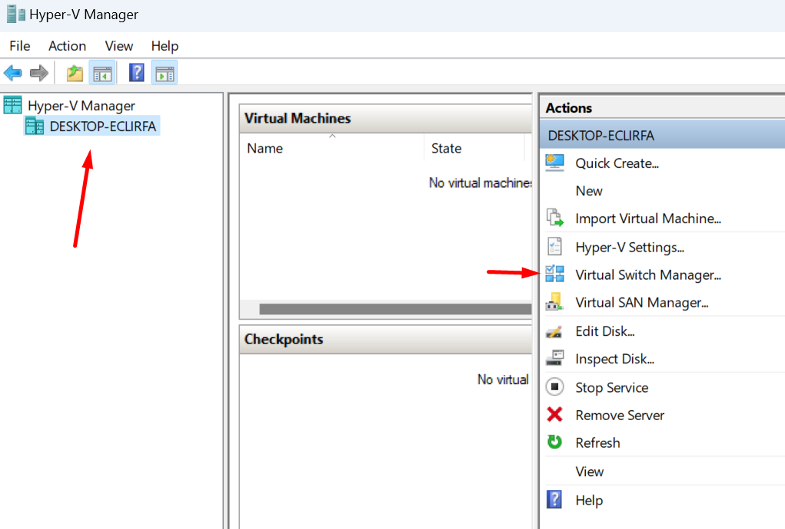
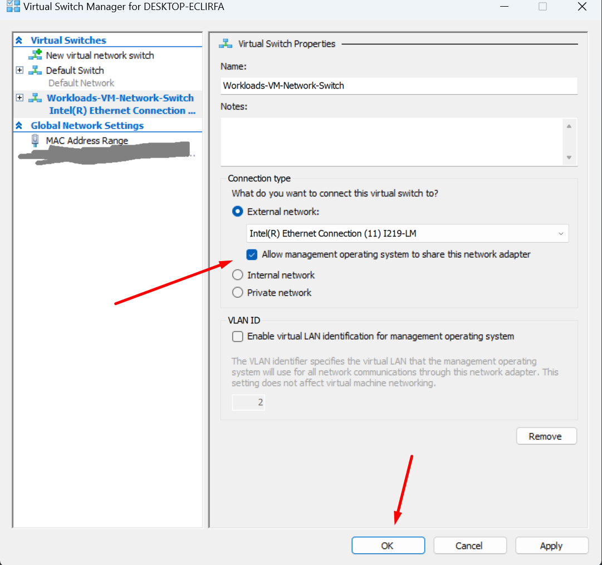
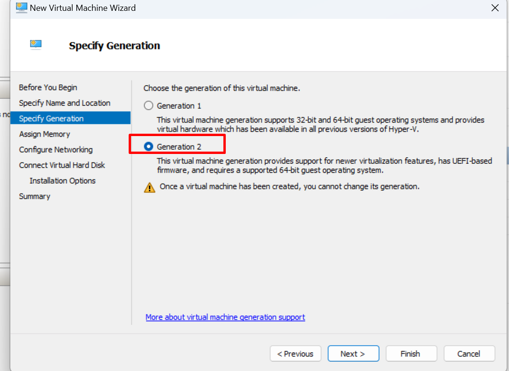
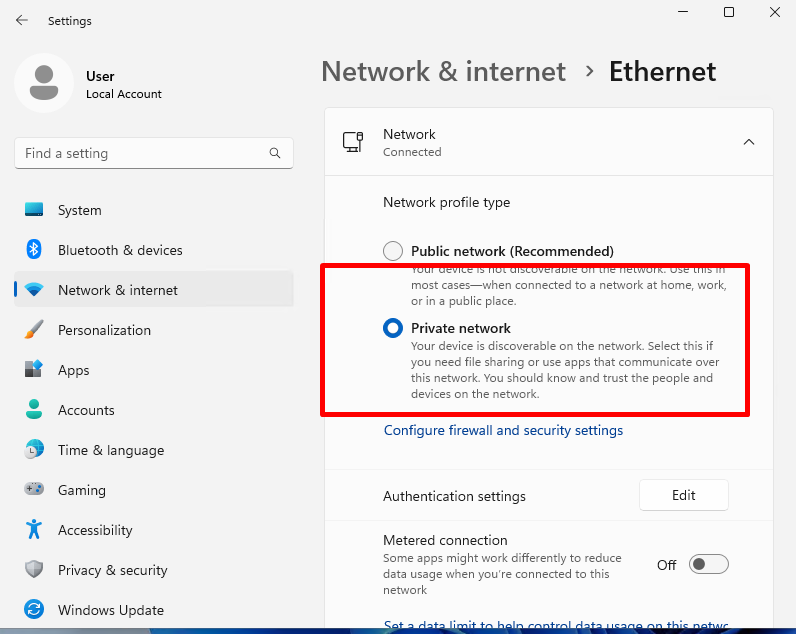
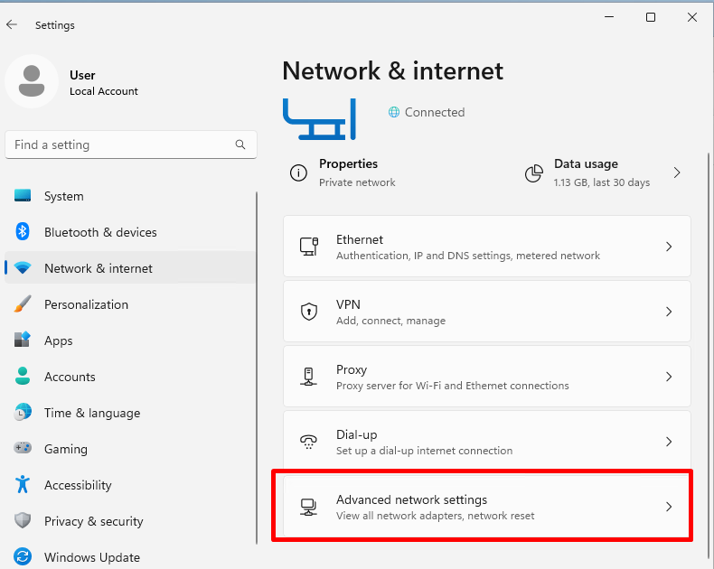
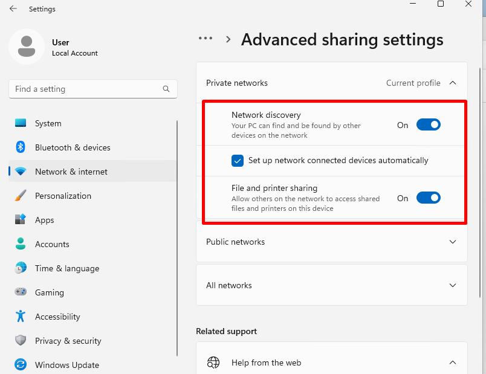

# VM-based installation tests

On Windows, when the .NET SDK is installed either via the standalone installer or by Visual Studio, it is installed to the Program Files folder.  In both cases it uses MSIs under the hood, so we call this an MSI-based install (as opposed to a file-based install which consists of unzipping or copying the .NET SDK files to an arbitrary folder).

For an MSI-based .NET SDK install, .NET SDK workloads are also installed using MSIs.  This modifies global machine state, which makes it hard to write automated tests for MSI-based workload operations.

To address this, the MSI Installation tests use a Virtual Machine as the target environment to install the .NET SDK and workloads.  APIs to run commands on the Virtual Machine or to inspect its file system are available and are similar to the test APIs used in other tests in the repo.

Because installation actions can be fairly slow, the test infrastructure uses VM snapshots (also called checkpoints) to avoid repeating an action that was already run.  Thus, if multiple tests have the same setup steps, those steps won't be repeated for each test, rather the correct snapshot will be applied when needed.  As tests are run, a tree of states (with corresponding snapshots) and actions to transition between them are built up from the initial state.  This tree of states is saved across test runs, so if nothing has changed then running a test a second time should complete very quickly, as all of the results of the test actions were already recorded.

## Setting up a VM for running tests

The main requirements for running the tests are:

- A Hyper-V Virtual Machine
- Access to the VM via the admin share (`\\TestVM\c$`)
- [PsExec](https://learn.microsoft.com/en-us/sysinternals/downloads/psexec) on the PATH of the host machine
- Windows Remote Management service running on host machine
- "Remote Service Management" enabled in firewall settings inside the VM (this avoids a delay of 15-30 seconds for each command that is run)
- Tests need to be run with admin priviledges, which are required to use the WMI APIs to control VMs

### Enable Hyper-V

Follow these instructions to enable Hyper-V on your host machine: [Enable Hyper-V](https://learn.microsoft.com/en-us/virtualization/hyper-v-on-windows/quick-start/enable-hyper-v)

### Set up a Virtual Switch

For the tests to remotely control the VM, your host computer needs to be able to access the VM over the network.  To enable this, you need to create a virtual switch for the VM which will also be shared by the host PC.  In Hyper-V Manager, click on your host machine and then go to Virtual Switch Manager. 



Create a new Virtual Switch connected to your external network adapter, and check the box that says "Allow management operating system to share this network adapter."



### Note: Virtual Machine names

There are two different names for a virtual machine.  There is the name that the host computer uses to identify the virtual machine.  This is what you see in Hyper-V Manager.  We call this name the "VM Name".  There is also the PC name that the Operating System inside the virtual machine uses to identify itself.  You can see or modify this in the system settings inside the virtual machine, and this is what you use to access the machine over the network.  We call this name the "VM Machine Name".

For example, if you use Hyper-V's "Quick Create" to create a Virtual Machine, the VM Name may be "Windows 11 dev environment", while the VM Machine Name may be "WINDEV2401EVAL".  In this case you would access the admin share using `\\WINDEV2401EVAL\C$`.

### Create a Hyper-V Virtual machine using Quick Create

The simplest way to create a virtual machine is to use "Quick Create".  This will create a virtual machine that is ready to use without having to do much configuration.  The virtual machine will have Visual Studio and the .NET SDK installed.  Currently this doesn't impact the tests, but in the future it may be necessary to uninstall Visual Studio from the virtual machine.

- In Hyper-V manager, select your host machine, select "Quick Create...", and choose "Windows 11 dev environment"
- In the same creation dialog, click "More Options" and select the virtual switch you created for Network
- Once the virtual machine is created, it will have a user account without a password.  You will need to add a password in order to connect to the machine over the network.  Go to sign-in options in the system settings and set up a password.

### Create a Hyper-V Virtual machine using a clean install

You can also create a virtual machine by installing Windows on it from scratch.  General instructions are [here](https://learn.microsoft.com/virtualization/hyper-v-on-windows/quick-start/create-virtual-machine).  To create the virtual machine:

- Download a Windows 11 .iso here: https://www.microsoft.com/en-us/software-download/windows11/
- You will need to choose a VM name when you create the VM and a VM machine name when setting up Windows inside the VM.  You can choose whatever names you want, but "Test VM" and "TestVM" are good defaults.
- In the networking configuration for the VM, select the Virtual Switch you created.
- Make sure that you create a generation 2 VM so UEFI is supported



- Right click the VM and go to settings. Under Security, check "Enable Trusted Platform Module" (and possibly the "Encrypt state..." checkbox under it), which is required to install Windows 11
- Start the VM and install Windows
- Probably you don't want to sign on to the test VM with a Microsoft account.  Setting up with a local account is tricky, but you can do so with these steps: https://web.archive.org/web/20240120203712/https://www.tomshardware.com/how-to/install-windows-11-without-microsoft-account
- In the VM settings in Hyper-V manager, enable all the integration services (so you can copy/paste files to the VM, for example)

### Further setup

These steps need to be taken regardless of the method used to create the virtual machine:

- In network settings inside the VM OS Windows Network Settings, switch the network connection type to Private Network, and turn on Network discovery and File and printer sharing.

The first setting can be found in the 'Ethernet' or 'Wireless Connection' tab at the top.



Network Discovery and File Sharing is found under the 'advanced' tab, then under Advanced Sharing Settings.





- Inside the VM, set the HKEY_LOCAL_MACHINE\SOFTWARE\Microsoft\Windows\CurrentVersion\Policies\System\LocalAccountTokenFilterPolicy registry value to 1 ([reference](https://learn.microsoft.com/en-us/troubleshoot/windows-server/windows-security/user-account-control-and-remote-restriction)).  This will allow you to access the admin share (for example, `\\TestVM\c$` or `\\WINDEV2401EVAL\c$`).
  - The easiest way to add this registry value is to run the following from an admin command prompt: `REG ADD HKEY_LOCAL_MACHINE\SOFTWARE\Microsoft\Windows\CurrentVersion\Policies\System /v LocalAccountTokenFilterPolicy /t REG_DWORD /d 1`
- After all of this, you _must_ restart your host machine and the VM. Failure to do so will result in 'Access Denied.' Browse to the admin share (for example `\\WINDEV2401EVAL\c$` in File Explorer to confirm it's working.  You will need to enter the username and password for the VM.  The username will be of the form `<VM Machine Name>\<Username>`, such as `WINDEV2401EVAL\User`.  Select the option to save the login information.  This will allow the tests to access the VM.
- Inside the VM, go to "Allow an app through Windows Firewall", and add "Remote Service Management" to the list of allowed apps and features.  This allows PsExec to launch commands quickly, otherwise there is a delay of around 15-30 seconds for each command that is run.
- Download PSTools (https://learn.microsoft.com/en-us/sysinternals/downloads/pstools), extract them somewhere, and add that folder to your PATH.  Run `psexec \\WINDEV2401EVAL cmd /c dir c:\` (replacing `WINDEV2401EVAL` with the VM machine name) to verify that PsExec can run commands on the VM.  The command should complete in less than a second.  If it takes longer then the Remote Service Management firewall rule is probably not enabled correctly.
- Create a `C:\SdkTesting` folder inside the VM.  Copy the standalone installer for the baseline version of the SDK used to test (for example `dotnet-sdk-8.0.100-win-x64.exe`) to that folder
- Make sure that the "Windows Remote Management" service is running on the host machine.  The easiest way to do this is to run `winrm quickconfig` from a command prompt.  This is needed for the tests to call the WMI APIs to control the virtual machine.
- Recommended:
  - Install [Visual Studio Remote Tools](https://learn.microsoft.com/visualstudio/debugger/remote-debugging?view=vs-2022#download-and-install-the-remote-tools) in the VM so that if you need to debug the SDK you can do so.  Run the remote tools and allow it through the firewall
  - Install any other tools or set up any other settings you would like on the VM to help investigate failures.  It's easier if you do this all as part of the initial state, otherwise each time you run a test the state will be reset so you may end up repeating the same actions multiple times.
- Create a snapshot (checkpoint) of the virtual machine in Hyper-V manager.  Rename the snapshot so that the name contains "Test start".  There needs to be exactly one snapshot with "Test start" in its name, which the tests will use as the initial root state.

## Test settings

Run the tests under Visual Studio -- to do so, you must launch Visual Studio with admin privileges.

The tests can read settings from a `VMTestSettings.json` file which you need to manually create. The tests store the VM State tree in a `VMState.json` file.  Both of these go in the current directory, which when running tests in Visual Studio will be `artifacts\bin\Tests\dotnet-MsiInstallation.Tests\Debug`.  The `VMTestSettings.json` file can have the following values:

- **VMName** - The name of the VM to use for testing.  This is the name displayed in Hyper-V manager.  This value doesn't need to be set if there is only one Virtual Machine on the host.
- **VMMachineName** - The machine name used by the VM's operating system.  This is what is used to browse to the machine in File Explorer, for example `\\TestVM`.  If this isn't specified, the tests will use the VM Name with any spaces removed for the VM machine name.
- **SdkInstallerVersion** - The version of the SDK to install for testing.  The installer for this version needs to be copied to `C:\SdkTesting` inside the VM.
- **ShouldTestStage2** - If set to true (which is the default), then the tests will copy the SDK implementation binaries to the installed SDK folder inside the VM.  Basically, you should leave this set to true if you want to test local changes to the SDK, and you should set it to false if you want to test the SDK specified in `SdkInstallerVersion`.
- **NuGetSourcesToAdd** - A list of NuGet sources to add to the NuGet.config before running tests.

Example:

```json
{
    "VMName": "TestVM",
    "VMMachineName": "WINDEV2401EVAL",
    "SdkInstallerVersion": "8.0.300-preview.24155.26",
    "NuGetSourcesToAdd": [
        "https://pkgs.dev.azure.com/dnceng/public/_packaging/dotnet9/nuget/v3/index.json"
    ]
}
```

## Checkpoint limit

Hyper-V supports a maximum of 50 checkpoints per VM.  This means that as more checkpoints are created and the limit is hit, tests will fail when they try to create checkpoints.  Thus, the checkpoints created by the tests will need to be deleted periodically.  Some pointers:

- Running all the tests will likely exceed the checkpoint limit.  To avoid this, run each test class separately, deleting the checkpoints between the runs.
- Re-building an SDK will result in a different stage 2 SDK, invalidating all of the old checkpoints.  So when you re-build the SDK, you usually want to delete the whole checkpoint tree under the previous "Deploy Stage 2 SDK" checkpoint.
- If you want to force a test to run a command instead of using the cached result, you can delete the corresponding checkpoint.

## Sharing test results

The test project is configured to save test results to `MsiInstallationTests.html` and `MsiInstallationTests.trx` in the `TestResults` folder.  You can use these files to share test results.  However, each time you run any tests, these files will be overwritten, so you may need to copy and rename them each time you run tests.

Note that once a test has run the result will be saved, so re-running the test will usually complete quickly without actually taking any actions on the VM.  So if you need to re-run a single test in order to fix something or due to test flakiness, once you have done so you can usually run all the tests in the test class again to get results files with all of those test results included.
